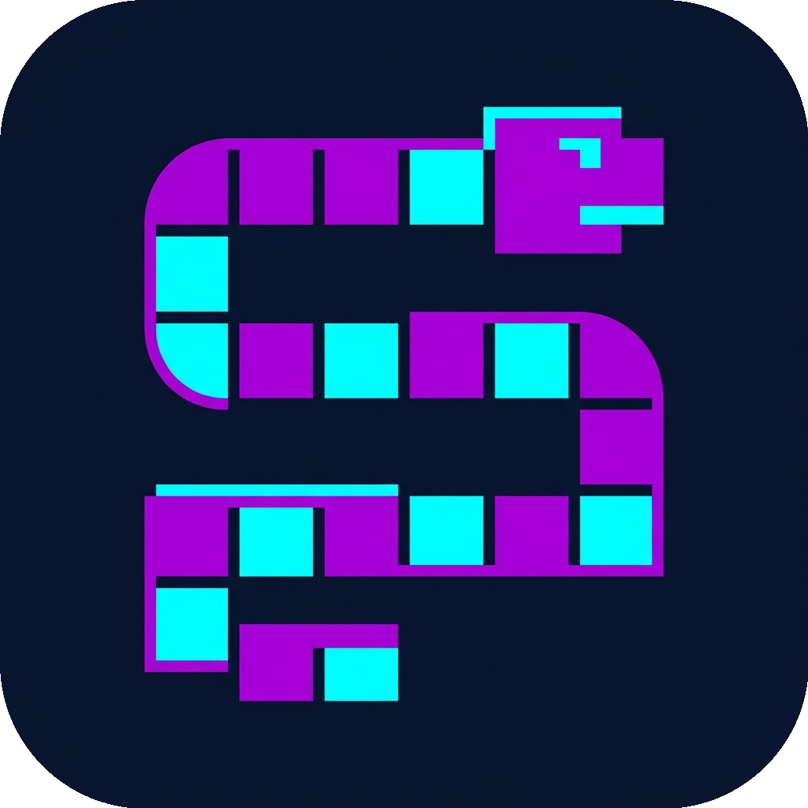
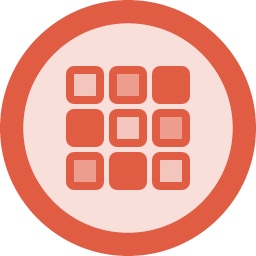
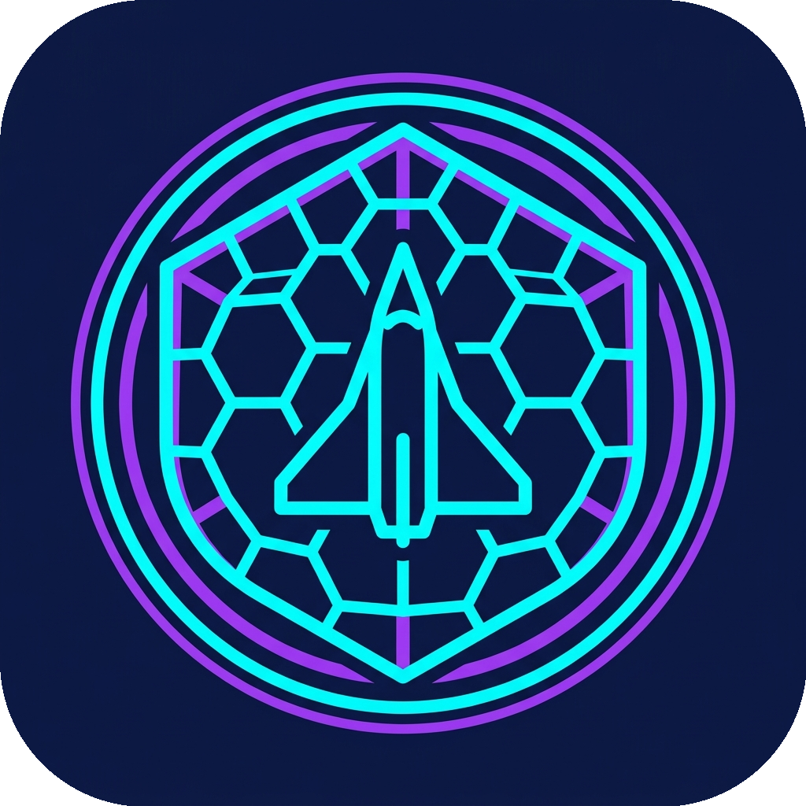

  

# studio2201

Self-hosted utilities and games built in Rust with Yew + WebAssembly
frontends and Axum backends. Clean, secure, and blazing fast.

## Apps

| App & Description | Repo | Port | Icon |
| :--- | :--- | :---: | :---: |
| **Beam**   High-performance, secure self-hosted file sharing. | [studio2201/beam](https://github.com/studio2201/beam) | `4401` |  |
| **Pad**   Collaborative real-time scratchpad. | [studio2201/pad](https://github.com/studio2201/pad) | `4402` |  |
| **Todo**   Minimalist task management. | [studio2201/todo](https://github.com/studio2201/todo) | `4403` |  |
| **Trace**   Network diagnostic, WHOIS, IP, and ASN lookup. | [studio2201/trace](https://github.com/studio2201/trace) | `4404` |  |
| **Grid**   Clean, lightning-fast self-hosted Kanban board. | [studio2201/grid](https://github.com/studio2201/grid) | `4405` |  |
| **Pulse**   Real-time system monitoring panel. | [studio2201/pulse](https://github.com/studio2201/pulse) | `4406` |  |

## Games

| Game & Description | Repo | Port | Icon |
| :--- | :--- | :---: | :---: |
| **Snake**   Classic snake game. | [studio2201/snake](https://github.com/studio2201/snake) | `4501` |  |
| **Rustle**   Self-hosted Wordle clone, dockerized. Forked from [modem7/react-wordle](https://github.com/modem7/react-wordle). | [studio2201/rustle](https://github.com/studio2201/rustle) | `4502` |  |
| **Scan**   Planetary hazard sector scanner. A Minesweeper clone. | [studio2201/scan](https://github.com/studio2201/scan) | `4503` |  |
| **Defend**   Retro-neon vertical space shooter. | [studio2201/defend](https://github.com/studio2201/defend) | `4504` |  |

## Media

| Media & Description | Repo | Port | Icon |
| :--- | :--- | :---: | :---: |
| **StateSync**   Real-time state-syncing media server. | [studio2201/statesync](https://github.com/studio2201/statesync) | `4601` |  |

## Core Libraries

| Library & Description | Repo | Port | Icon |
| :--- | :--- | :---: | :---: |
| **Shared Assets**   Shared design system, UI components, and backend utilities. | [studio2201/shared-assets](https://github.com/studio2201/shared-assets) | `—` |  |

## Desktop & Screensavers

| App & Description | Repo | Port | Icon |
| :--- | :--- | :---: | :---: |
| **Trance**   Modular, high-performance Wayland screensaver daemon & idle engine in Rust. | [studio2201/trance](https://github.com/studio2201/trance) | `—` |  |
| **Trance Plugins**   Official screensaver effects pack for Trance. | [studio2201/trance-plugins](https://github.com/studio2201/trance-plugins) | `—` |  |

<!--
Placeholder icons: defend.png, rustle.png, snake.png, statesync.png are temporary copies of
beam.png and should be replaced with per-app icons when available.
-->
