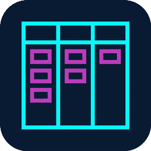
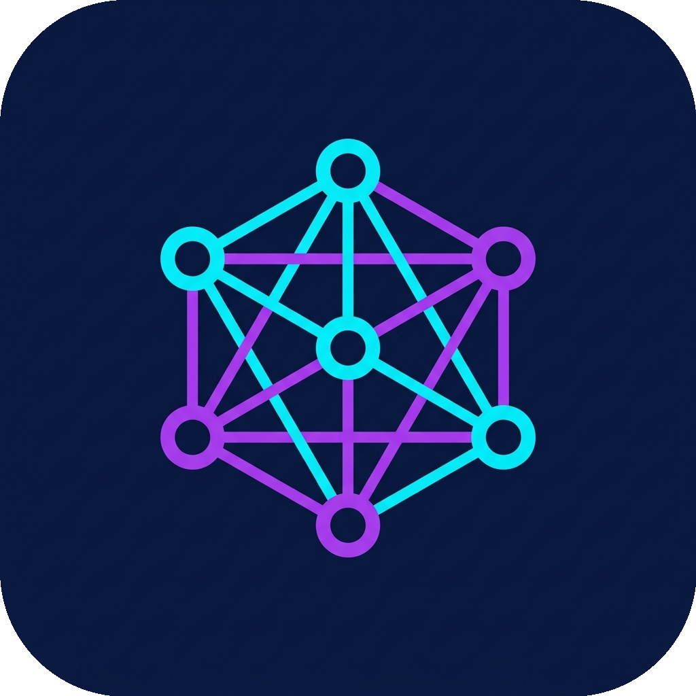
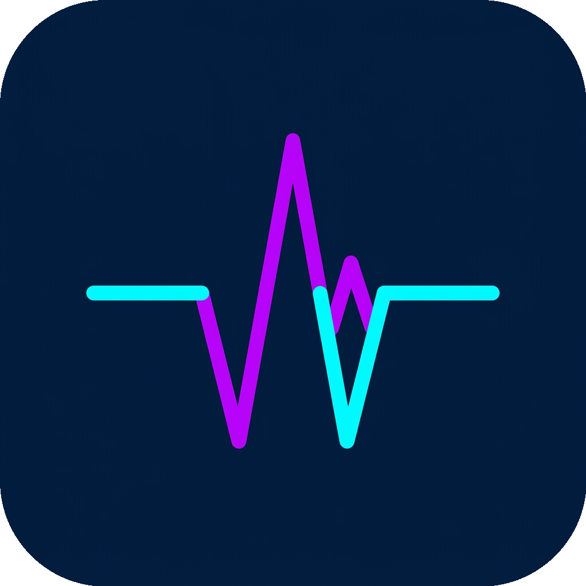

  

# etecoons

Clean, secure, and blazing-fast self-hosted utilities built in Rust.

## Apps

| App | Repo | Icon |
| :--- | :--- | :---: |
| **Beam**   High-speed, secure file dropper transfer utility. | [etecoons/beam](https://github.com/etecoons/beam) |  |
| **Grid**   Self-hosted Kanban board application. | [etecoons/grid](https://github.com/etecoons/grid) |  |
| **Pad**   Collaborative real-time scratchpad. | [etecoons/pad](https://github.com/etecoons/pad) |  |
| **Todo**   Minimalist task management tool. | [etecoons/todo](https://github.com/etecoons/todo) |  |
| **Trace**   Network diagnostic, WHOIS, IP, and ASN lookup utility. | [etecoons/trace](https://github.com/etecoons/trace) |  |
| **Pulse**   Real-time system monitoring panel. | [etecoons/pulse](https://github.com/etecoons/pulse) |  |
| **Scan**   Planetary hazard sector scanner (Minesweeper clone). | [etecoons/scan](https://github.com/etecoons/scan) |  |

## Deployment

Deploy any of these applications using **Docker / Podman** containers, or install them on **Unraid** using the official templates repository:

* **Unraid Templates:** [etecoons/unraid-apps](https://github.com/etecoons/unraid-apps)
* **Docker Registry:** Pull namespace `ghcr.io/etecoons/` (GitHub Container Registry)

